# Workshop Datapack for Minecraft (2025)

# Part 1: Artefacts

Today we're going to guide you through the creation of your first datapack for Minecraft Java.

In this workshop, you'll learn how to format a pack and how to create custom items in a data-oriented manner.

At the end of this workshop, you should know how to make these kinds of items:

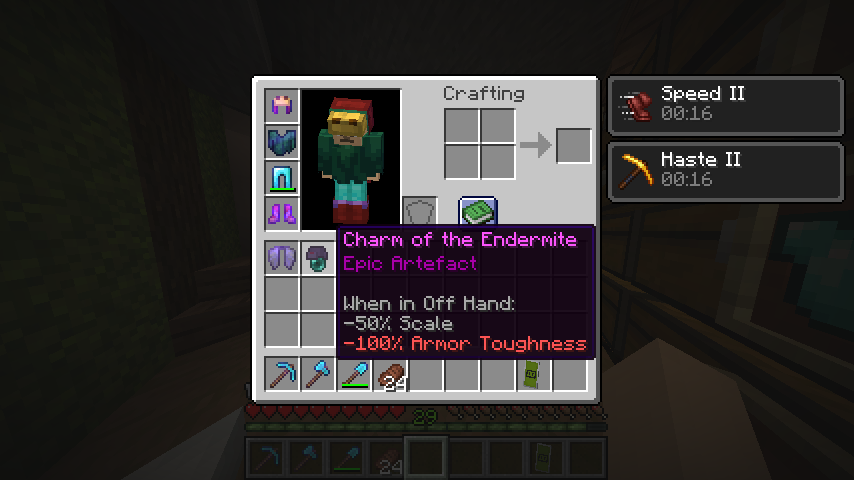

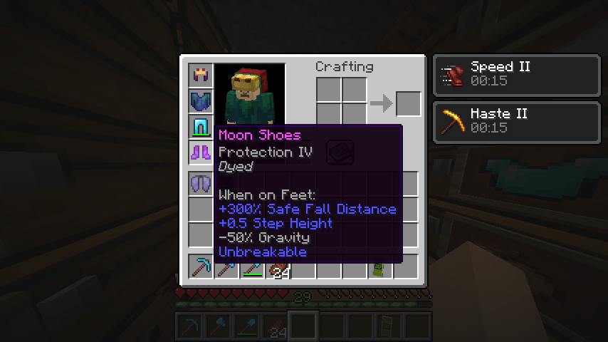

(yep, even the chestplate and the helmet were made using data-oriented items)

## Let's Get The Party Started

Put on your [favourite music](https://open.spotify.com/playlist/5WPxmg5zHF4pgwGAemsPKX?si=5ddddcd87347437d) because we're starting here!

We'll assume you already own Minecraft for Java (legally). You can do this Workshop on both Windows, Mac and Linux.

Launch Minecraft in the **lastest version** (1.21.4). This is important since the Datapack formating is reguarly updated.

Create a new world with cheats enabled:

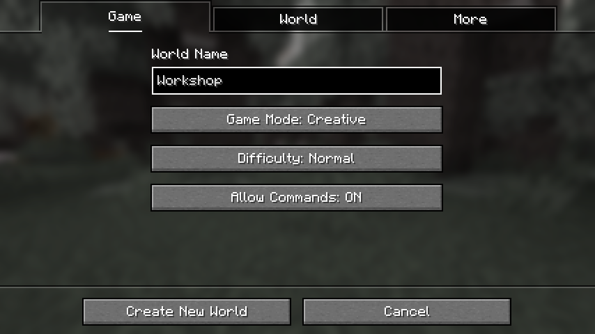

## Do It All The Time

Before everything, let's learn about commands. (you'll need them a lot!)

Open your chat, then write `Hello Bob!`. Then, to make it a command, write `/say Hello Bob!` instead.

The `/` is the root of every command. Need more information? Just type `/help say`.

![[Lipatant] Hello Bob!](doc/SayHelloBob.png)

## Creator

Now that you can harness this new power, you'll need to get an item through the use of commands.

If you type `/help give`, the game will answer with `/give <targets> <item> [<count>]`.

The `count` parameter is optional, so we'll leave it empty.

The `item` parameter can be filled with any identifier: you can use, for example, `minecraft:diamond`.

But what about `targets`? Well, here's a little cheat sheet:

| Selector              | Meaning           | Description                               |
| -------------         | -------------     | -------------                             |
| (player's name)       |                   | The selected **player**                   |
| @a                    | All               | All the **players**                       |
| @e                    | Everyone          | All the **entites** (players, mobs...)    |
| @n                    | Nearest           | The nearest **entity**                    |
| @p                    | Player/Proximity  | The nearest **player**                    |
| @r                    | Random            | A random **player**                       |
| @s                    | Self              | The **entity** using the command (you)    |

If you need help more help with that, here's an useful page about selectors [Target selectors](https://minecraft.wiki/w/Target_selectors).

![Gave 1 [Diamond] to Lipatant](doc/GaveDiamond.png)

## It's Going Down Now

We'll learn how to create our datapack.

### **Directory**

You can open the world's folder.

If you don't know where it is, leave your world, go in Singleplayer, then select your world and edit it. You'll be able to click on **Open World Folder**

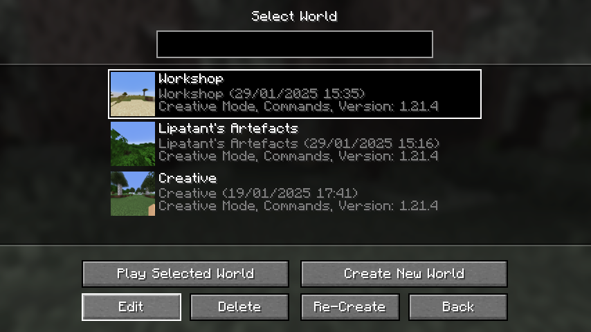

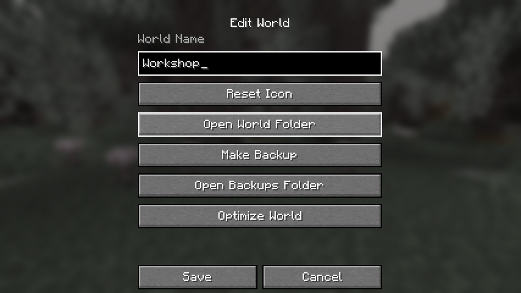

If it still doesn't work, you can go directly to your directory `$env:APPDATA\.minecraft\saves\Workshop\`.

### **Import**

Now that you're in the right folder, go in `datapacks/` and import the given `WorkshopPart1` folder.

If you have troubles, you can consult the following page [Tutorials/Installing a data pack](https://minecraft.wiki/w/Tutorials/Installing_a_data_pack).

### **Testing the pack**

You can now test if everything is working correctly. But before that, use the `/reload` command.

**You'll have to use this command after every change on your code**.

Now, you can use `/datapack list` and check if `[file/WorkshopPart1 (world)]` appears.

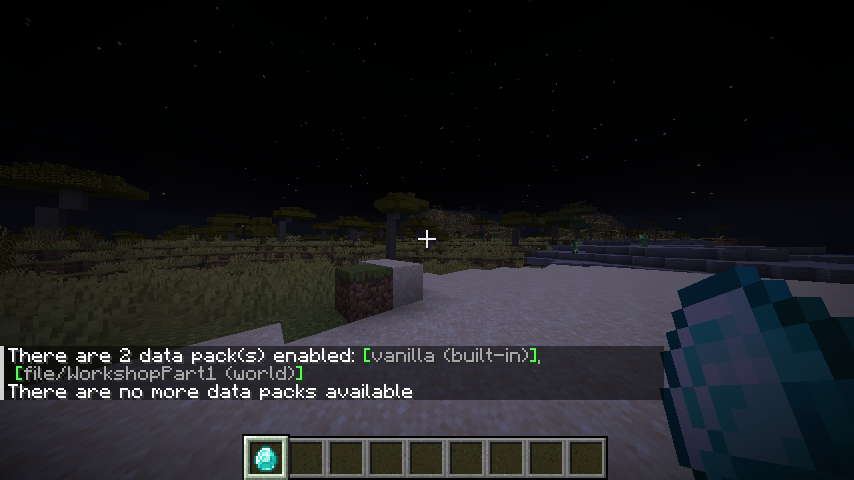

## Iron Man

For the following steps, we will be making a custom robot helmet, effectively teaching us the basics of custom items.

We've included, in the `data/workshop/recipe` directory a file named `antenna.json`.

Currently, it allows us to craft an Iron Helmet made from Copper Ingots.

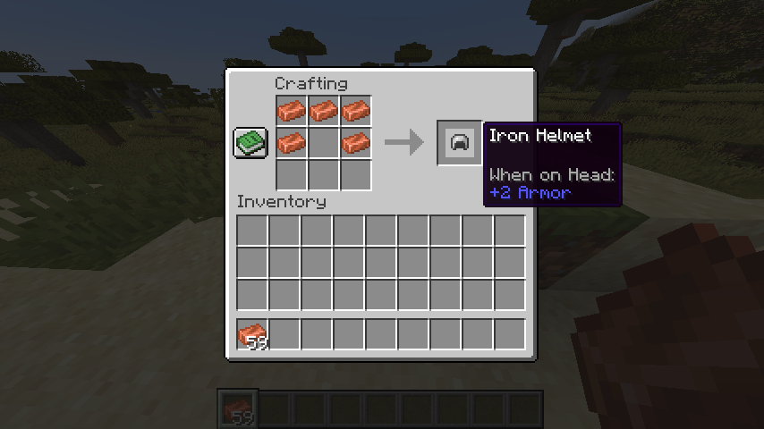

Our first goal will be to rename our item to `Antenna` by overwriting the `minecraft:item_name` component. (see [Data component format](https://minecraft.wiki/w/Data_component_format))

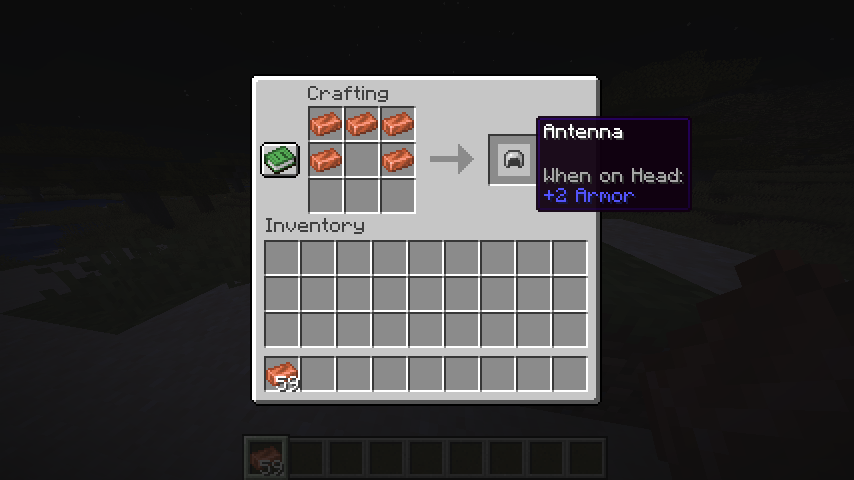

## Payphone

It's an antenna, but in name only. Let's fix it!

Find the component responsible for the item's appearance and overwrite it for `minecraft:lightning_rod`.

Our helmet will still be technically an Iron Helmet, but it will look like a Lightning Rod.

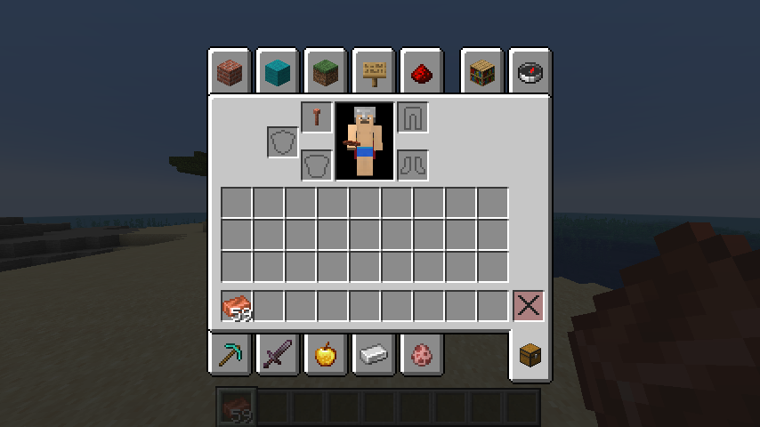

However, now we still have an issue: when equipped, our item keeps its original appearance.

We'll have to overwrite the `minecraft:equippable` component. We'll only write the `slot` key and its value.

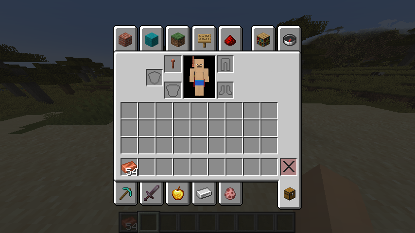

Beep Boop!

## Under Pressure

So, it's just a reskinned Iron Helmet, right? WRONG! Well, right for now, but not for long.

Minecraft manages certain entity values through attributes.

If you go on [Attribute](https://minecraft.wiki/w/Attribute), you'll see those usable by the player are :

- Armor
- Armor Thoughness (on Diamond and Netherite Armor)
- Attack Damage
- Attack Knockback
- Attack Speed
- Block Break Speed
- Block Interaction Range
- Burning Time (on the reworked [Fire Protection](https://minecraft.wiki/w/Fire_Protection))
- Entity Interaction Range
- Explosion Knockback Resistance (on the reworked [Blast Protection](https://minecraft.wiki/w/Blast_Protection))
- Fall Damage Multiplier
- Knockback Resistance
- Gravity
- Jump Strenght
- Luck (for fishing, not really used as an attribute but weirdly affected by [Luck of the Sea](https://minecraft.wiki/w/Luck_of_the_Sea))
- Max Absorption (yellow hearts)
- Max Health (red hearts)
- Mining Efficiency
- Movement Efficiency
- Movement Speed
- Oxygen Bonus
- Safe Fall Distance
- Scale (weirdly fun to mess around)
- Sneaking Bonus
- Step Height
- Submerged Mining Speed
- Sweeping Damage Ratio
- Water Movement Efficiency

You didn't read at least half of it, did you?

Now, let's pick an attribute to mess with on our Antenna. What about... Scale?

Ok, we will overwrite here the `minecraft:attribute_modifiers` component and define an attribute `scale` that grants `-50%` when on Head, with an id of `minecraft:armor.helmet`.

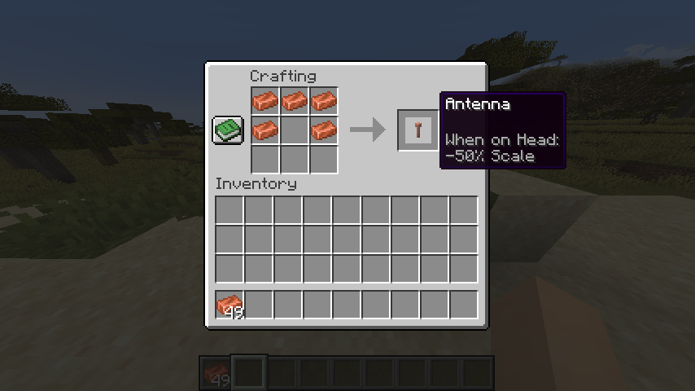

Cool, but we lost our `+2 Armor` default attribute, so we'll have to add it and...

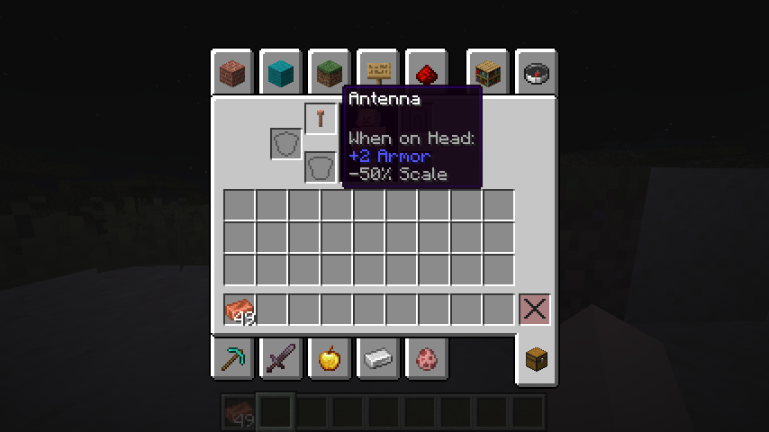

Done! Now we're smoool!

## Bonus

Now that we've done that, you can add:

- Propeller Hat: A helmet that can act as an Elytra.
- Fishing Jacket: A chestplate that increases for luck, for fishermen obviously.
- Big Legs: Leggings that increase your scale.
- Moon Shoes: Boots that reduce the player's gravity.
- Drilling Pickaxe: A pickaxe with increased mining effiency.
- Battle Shield: A shield that can be used as a weapon.